# Climate Resilience Platform (Soacha)

## **1. LOGICAL VIEW: Alert Generation and Intervention Lifecycle State Diagram**

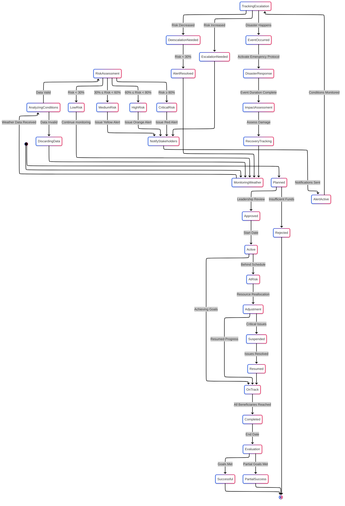

---

## **2. PROCESS VIEW: Activity & Sequence Diagrams**

### **2.1 Climate Alert Generation, Intervention Effectiveness Analysis and Zone Risk Recalculation Activity Diagram**

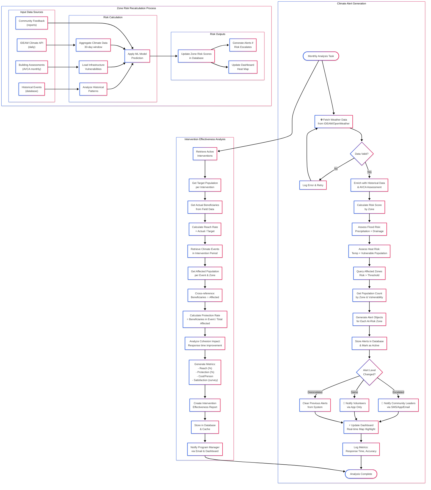

### **2.2 Population Impact Assessment; Field Data Collection & Reporting Sequence Diagram**

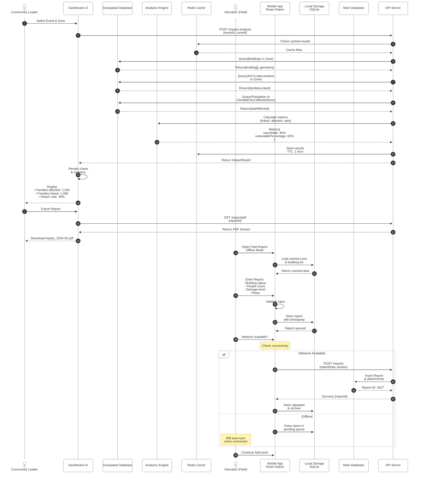

---

## **3. DEVELOPMENT VIEW: Component Architecture and Package (Module dependencies) Diagram**

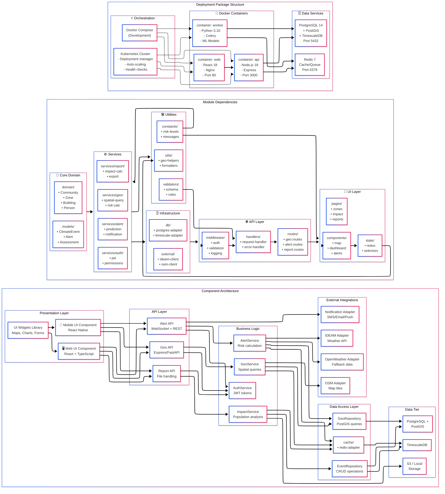

---

## **4. PHYSICAL VIEW: Production Deployment Architecture and Development Environment Deployment**

---

## **5. USE CASE VIEW: Scenarios (+1)**

### **5.1 Use Case Diagram**

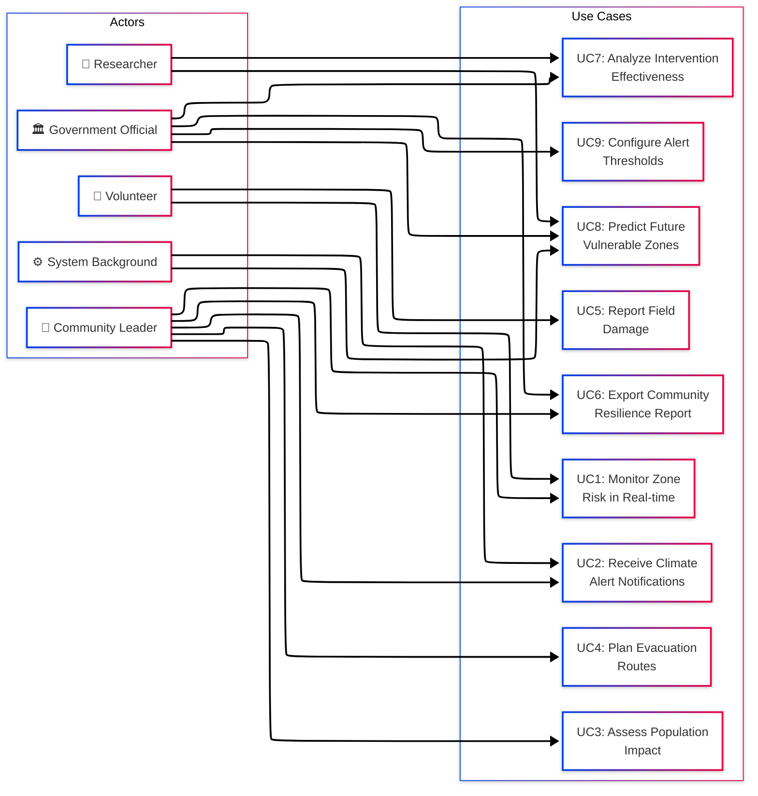

### **5.2 Detailed Use Case Specifications**

#### **UC1: Monitor Zone Risk in Real-time**

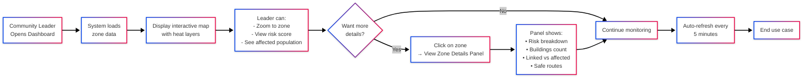

---

#### **UC2: Receive Climate Alert Notifications**

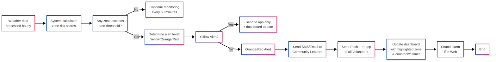

---

#### **UC3: Assess Population Impact**

```mermaid
---
config:
  theme: neo
  look: neo
---
graph LR
    A["Government Official<br/>selects Event & Date"] --> B["System queries<br/>affected zone geometry"]
    B --> C["Find all buildings<br/>in affected zone"]
    C --> D["Count residents<br/>per building"]
    D --> E["Cross-reference with<br/>AVCA intervention data"]
    E --> F["Calculate metrics:<br/>- Total affected<br/>- Previously linked<br/>- Reach rate"]
    F --> G["Calculate vulnerable ratio:<br/>- Disabled persons<br/>- Elderly<br/>- Children"]
    G --> H["Generate report with:<br/>Charts, tables,<br/>statistics, maps"]
    H --> I["Option: Export to<br/>PDF/Excel"]
    I --> J["End"]
```

---

#### **UC4: Plan Evacuation Routes**

```mermaid
---
config:
  theme: neo
  look: neo
---
graph LR
    A["Community Leader<br/>receives high alert"] --> B["Opens Map<br/>in emergency mode"]
    B --> C["Highlights affected zone<br/>in red"]
    C --> D["System shows 3 pre-calculated<br/>evacuation routes:<br/>- Route A: 2.3 km<br/>- Route B: 3.1 km<br/>- Route C: 4.5 km"]
    D --> E["Each route shows:<br/>- Safe Buildings<br/>- Checkpoints<br/>- Capacity"]
    E --> F["Leader selects<br/>Route A"]
    F --> G["System calculates<br/>evacuation time for<br/>el
derly = 45 min"]
    G --> H["Leader initiates<br/>evacuation protocol<br/>via 'Activate' button"]
    H --> I["System sends<br/>SMS to residents<br/>+ volunteers"]
    I --> J["Dashboard tracks<br/>evacuation progress"]
    J --> K["End"]
```

---

#### **UC5: Report Field Damage**

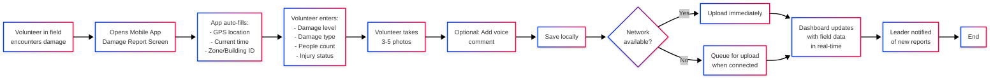

---

#### **UC6: Export Community Resilience Report**

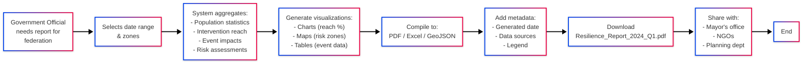

---

#### **UC7: Analyze Intervention Effectiveness**

```mermaid
---
config:
  theme: neo
  look: neo
---
graph LR
    A["Data Scientist<br/>opens Analytics Tool"] --> B["Select intervention:<br/>Cohesion Workshop"]
    B --> C["Time range:<br/>Q4 2023 - Q4 2024"]
    C --> D["System queries:<br/>- Workshop participants<br/>- Zones covered<br/>- Climate events in zones<br/>- Affected population"]
    D --> E["Calculate metrics:<br/># reached / # target"]
    E --> F["Correlate with events:<br/># in intervention zone<br/>/ # total affected"]
    F --> G["Statistical analysis:<br/>Did training improve<br/>response time?"]
    G --> H["Visualize with:<br/>- Scatter plots<br/>- Heat maps<br/>- Trend lines"]
    H --> I["Export methodology<br/>& findings"]
    I --> J["Share with<br/>academic partners"]
    J --> K["End"]
```

---

#### **UC8: Predict Future Vulnerable Zones**

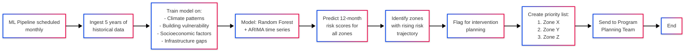

---

#### **UC9: Configure Alert Thresholds**

```mermaid
---
config:
  theme: neo
  look: neo
---
graph LR
    A["Emergency Coordinator<br/>manages alert config"] --> B["Opens Settings:<br/>Alert Configuration"]
    B --> C["Current settings:<br/>- Generic thresholds<br/>- All zones same"]
    C --> D["Coordinator can:<br/>1. Edit flood risk %<br/>2. Edit heat index<br/>3. Edit alert delays"]
    D --> E["Customize per zone:<br/>El Danubio: 75%<br/>La María: 70%"]
    E --> F["Set notification rules:<br/>- Yellow: Leaders only<br/>- Orange: + Volunteers<br/>- Red: + Media"]
    F --> G["Configure timing:<br/>Advance notice: 24h"]
    G --> H["Save configuration<br/>+ version control"]
    H --> I["System logs:<br/>Who, when, what changed"]
    I --> J["Next alert uses<br/>new thresholds"]
    J --> K["End"]
```

---

## **6. TECHNICAL PATTERNS & DESIGN DECISIONS**

### **Pattern 1: Real-time Alert Distribution**

```
Event: High Risk Detected
├─ Alert object created with ID: ALT-2024-02-08-001
├─ Persisted to database (PostgreSQL)
├─ Published to Redis Pub/Sub channel: "alerts:zone_3"
├─ Subscribers receive (WebSocket):
│  ├─ API Server 1 → broadcast to connected web clients
│  ├─ Notification Worker → dispatch SMS/Email/Push
│  ├─ Logging Service → store for audit trail
│  └─ Analytics Service → model improvement pipeline
└─ State stored in Redis for 7 days (audit + replay)
```

### **Pattern 2: Geofencing for Zone Containment**

```sql
-- Query: Find all buildings within flood risk zone
SELECT b.building_id, b.residents, p.name
FROM buildings b
JOIN persons p ON b.building_id = p.building_id
WHERE ST_DWithin(
    b.geometry,
    (SELECT geometry FROM zones WHERE zone_id = 3),
    0  -- Exactly within zone (no buffer)
)
AND ST_Intersects(b.geometry, event.affected_geometry)
ORDER BY p.age DESC  -- Prioritize monitoring elderly
```

### **Pattern 3: Caching Strategy (Multi-Layer)**

```
Request: Get zone risk scores
├─ L1: Browser localStorage (1 hour) ← Fastest
├─ L2: Redis cache (1 hour) ← Shared across API servers
├─ L3: PostGIS materialized view (10 min) ← Computed cache
└─ L4: Full calculation (every 60 min) ← Slow, authoritative

Strategy: Check L1 → L2 → L3 → L4 (in order)
Invalidation: When weather data refreshed, clear L2+L3
```

### **Pattern 4: Event Sourcing for Accountability**

```
All state changes logged as events:
├─ alert_created
├─ alert_escalated (from YELLOW to ORANGE)
├─ alert_notification_sent (to leader_id: 123)
├─ evacuation_initiated (zone_id: 3)
├─ damage_report_filed (volunteer_id: 456)
├─ intervention_completed
└─ all_events_queried_by_dashboard

Benefits:
- Audit trail of who did what when
- Replay events to test scenarios
- Calculate metrics across time
```

---

## **7. SCALABILITY & PERFORMANCE TARGETS**

| Metric | Target | Current Approach | Scale-up Strategy |
|--------|--------|------------------|-------------------|
| **Zone Risk Calculation** | <30s for all zones | Sequential processing | Parallel by zone (Celery workers) |
| **Alert Delivery** | <2 min to first responder | Direct SMS API calls | Queue-based with retry logic |
| **Dashboard Load Time** | <3s | Data aggregation per view | GraphQL + pre-computed aggregates |
| **Concurrent Users** | 500 volunteers | Single API server | Kubernetes HPA (horizontal pod autoscaling) |
| **Data Ingestion** | Real-time (60m intervals) | Batch hourly | Stream processing (Kafka) for <10m latency |
